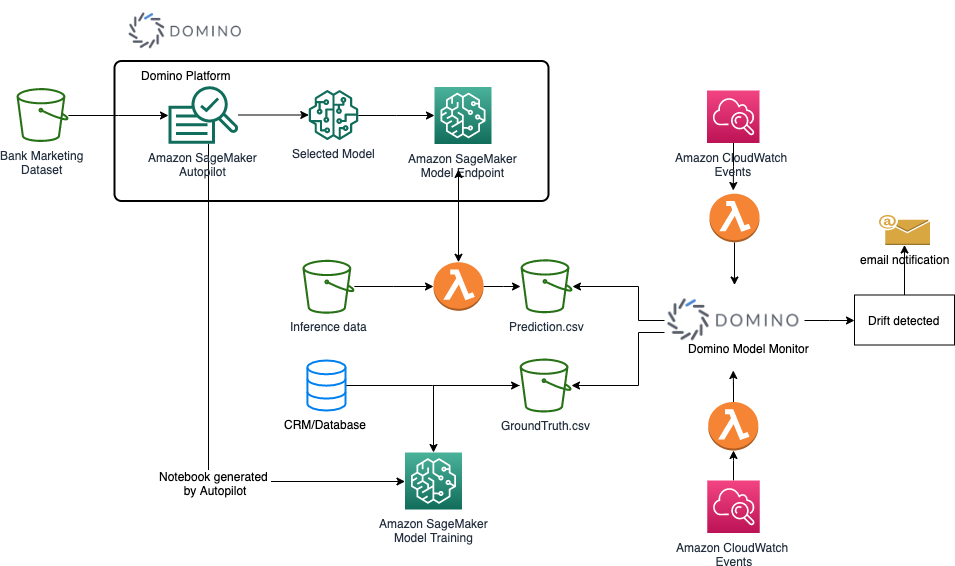
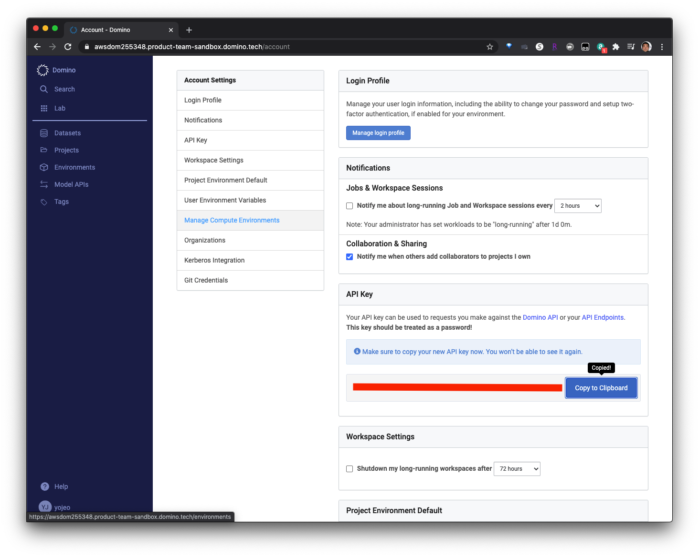
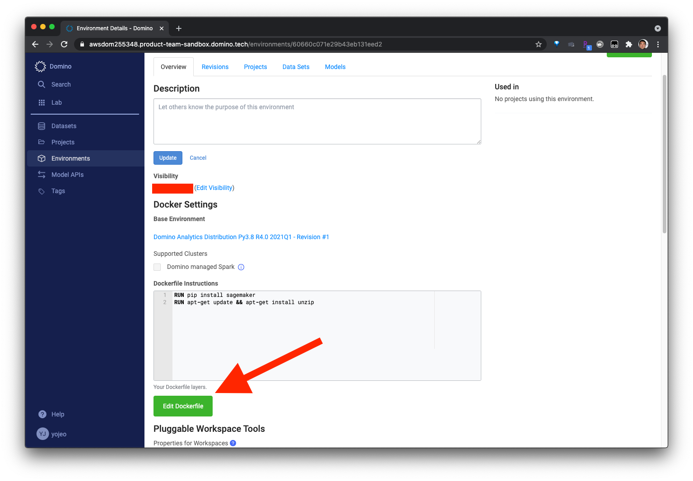
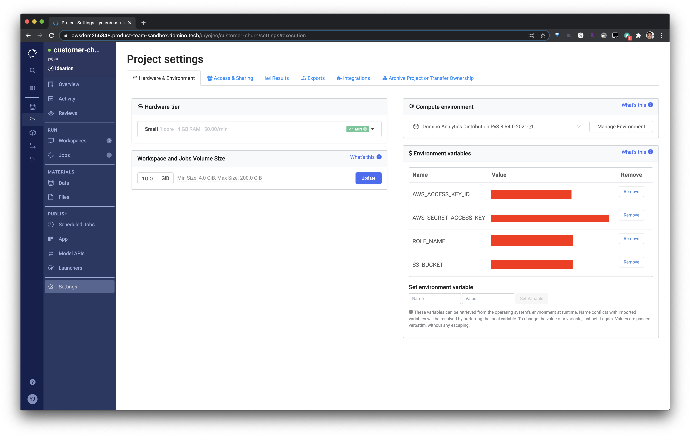
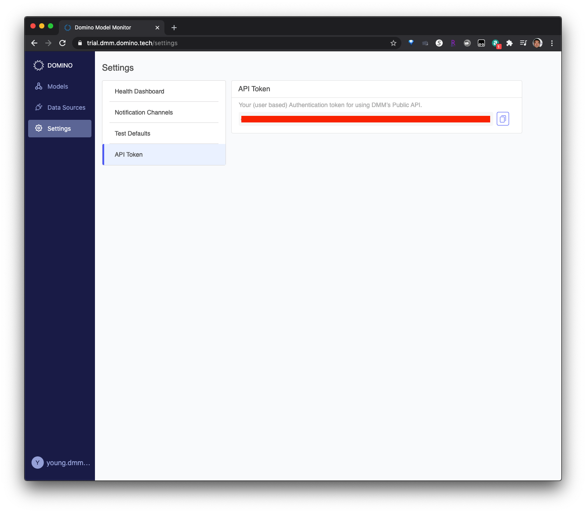
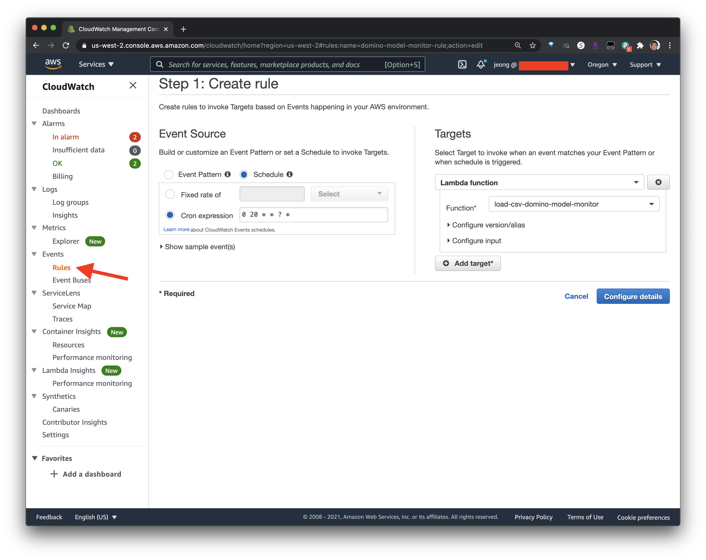

# How to Architect end-to-end development, monitoring, and maintenance of your models in AWS and Domino Data Lab

## Introduction

As a Data Scientist or an ML Engineer, it is critical to produce a complete ML process that consists of a true end-to-end development. 
As a machine learning model is created and deployed in production, real-life data over time may skew away from the data seen during the training. 
This concept, also known as "data drift", requires careful monitoring to ensure that you will then take corrective measures to 
ensure the continuity of highly accurate model (via retraining). 

In this technical workthrough, you will learn how to architect an end-to-end ML process that will do the following:

- Ingest a bank marketing dataset for a customer churn problem,
- Automatically train algorithms, tune hyperparameters, and select the best performing model,
- Create a production endpoint,
- Automate batch inferences of in-production data (optional),
- Compare the training data and the inference data, and
- Create an alerting mechanism to notify you in case data drift is detected

Please note: this is a technical workthrough, not a step-by-step workshop.

## Solutions and Tools Used

The following solutions and tools are leveraged for the complete workflow:

### [Domino Data Lab Data Science Platform](https://www.dominodatalab.com/product/domino-data-science-platform/) - "The Open Data Science Platform for the Enterprise."
Domino centralizes data science work and infrastructure across the enterprise for collaboratively building, training, deploying, and managing models – faster and more efficiently. With Domino, data scientists can innovate faster, teams reuse work and collaborate more, and IT teams can manage and govern infrastructure. 

In this walkthrough, we will use the Domino's Data Science Platform to manage a customer churn model training, tuning and model development.

### [Domino Model Monitor](https://www.dominodatalab.com/product/domino-model-monitor/) - "Monitor the Health of All Production Models"
Domino Model Monitor (DMM) creates a “single pane of glass” to monitor the performance of all models across your entire organization. Data scientists can focus on value-added projects and receive alerts when production models degrade. Data drift, model quality, and other health statistics are provided in an easy-to-understand dashboard so you can assess the business impact and initiate proactive actions.

In this walkthrough, we will leverage Domino Model Monitor to capture the inference and prediction data, detect possible data drift, and then alert users if the drift occurs.

### [Amazon SageMaker](https://aws.amazon.com/sagemaker/)

Amazon SageMaker helps data scientists and developers to prepare, build, train, and deploy high-quality machine learning (ML) models quickly by bringing together a broad set of capabilities purpose-built for ML. 

### [Amazon SageMaker Autopilot](https://aws.amazon.com/sagemaker/autopilot/)

Building machine learning (ML) models requires you to manually prepare features, test multiple algorithms, and optimize hundreds of model parameters in order to find the best model for your data. However, this approach requires deep ML expertise. If you don’t have that expertise, you could use an automated approach (AutoML), but AutoML approaches typically provide very little visibility into the impact of your features for model predictions. As a result, you may have less trust in it because you can’t recreate it and you can’t learn how it makes predictions.

Amazon SageMaker Autopilot eliminates the heavy lifting of building ML models, and helps you automatically build, train, and tune the best ML model based on your data. With SageMaker Autopilot, you simply provide a tabular dataset and select the target column to predict, which can be a number (such as a house price, called regression), or a category (such as spam/not spam, called classification). SageMaker Autopilot will automatically explore different solutions to find the best model. You then can directly deploy the model to production with just one click, or iterate on the recommended solutions with Amazon SageMaker Studio to further improve the model quality.

In this walkthrough, we will leverage Autopilot feature within the Domino's Data Science Platform to automatically build, train and tune the best customer churn model based on the banking dataset.

Once the best performing model is identified, we will use [SageMaker's endpoint deployment](https://docs.aws.amazon.com/sagemaker/latest/dg/how-it-works-deployment.html) service to deploy the model. This endpoint is a callable API to produce a prediction result based on the inference data.  

### Other Amazon Services

The following services are used as part of the architecture:

- [Amazon S3](https://aws.amazon.com/s3/)
- [Amazon CloudWatch](https://aws.amazon.com/cloudwatch/)
- [AWS Lambda](https://aws.amazon.com/lambda/)


## Solution Architecture



### Workflow
1. Bank Marketing Dataset, stored in an Amazon S3 bucket, is imported into a notebook on Domino's Data Science Platform.
1. The notebook runs a SageMaker Autopilot job that will automatically train, tune and select the best performing classification model on your AWS account.
1. The selected model will then be deployed on a SageMaker Model Endpoint.
1. Inference Data, batched in an csv file into an S3 bucket, will trigger an AWS Lambda function that will call the model endpoint.
1. The result will be stored as a prediction.csv file into an S3 bucket.
1. An Amazon CloudWatch Events rule, set to trigger once a day, will invoke another Lambda function to call on the Domino Model Monitor API, to send the prediction.csv and to compare with the training data for any data drift.
1. If there is a data drift per specified threshold, the Domino Model Monitor notifies with an email set in the Model Monitor settings.

### Prerequisites

1. Set up AWS Account with Access Keys (Access Key ID and Secret Access Key)
2. Set up S3 Bucket (Bucket name must be globally unique; you will need this bucket name for the notebook)
3. Create a SageMaker service role using IAM, and add access permission to your S3 Bucket (Specifically GetObject, PutObject, and ListBucket).
4. Set up Domino Platform & Model Monitor Trial Accounts.
   - Try DMM [here](https://go.dominodatalab.com/dmm-trial).
   - Try Domino Data Science Platform [here](https://www.dominodatalab.com/trial/).
5. The walkthrough assumes you have basic knowledge of Jupyter notebook and SageMaker. 

## Implementation Steps

### Setting up your Domino's Data Science Platform
1. Log into your Domino's Data Science Platform and access Account Settings.
2. Regenerate an API key to be used for accessing Domino API, and save the key on a notepad or somewhere you can access later. 

3. Next, we want to make sure the notebook environment has all the necessary libraries. Click Environments and select the default. If it already does not have Dockerfile instructions, Edit Dockerfile to add the following lines:
```
RUN pip install sagemaker
RUN apt-get update && apt-get install unzip
```


4. Create a new Project called "Customer-Churn". 
5. Upload the "sagemaker_autopilot_direct_marketing.ipynb" notebook file under Materials -> Files inside your new Project.
6. Register the following environment variables under Project Setting:
    - AWS_ACCESS_KEY_ID: your AWS Access Key ID
    - AWS_SECRET_ACCESS_KEY: your AWS Secret Access Key
    - ROLE_NAME: Name of your SageMaker Service Role
    - S3_BUCKET: Name of your S3 Bucket
    
    


### Creating an Autopilot job on Domino's Platform
1. Create a new Workspace inside your Domino Project using either Jupyter or JupyterLab.
2. Open the notebook that was uploaded earlier and run it. The notebook will start an Autopilot Job, select the best model and create a Model Enpoint on your AWS Account. Stop before "Clean Up" Section. 

There is a detailed documentation on the notebook about Autopilot. But if you want to learn more on Autopilot, you can additionally use this [tutorial](https://aws.amazon.com/getting-started/hands-on/create-machine-learning-model-automatically-sagemaker-autopilot/).

### Setting up your Domino Model Monitor
1. Log into your Domino Model Monitor Account and access Settings.
2. Copy the API Token; this will be used in the Lambda functions.

    
3. Under Data Source, add your S3 bucket. You will need the Bucket Name, region, AWS Access Key and the Secret Key.
4. The assumption here is that the model already exists, and the training data is already uploaded to the model. The Lambda function you set up will send in the prediction data to the existing model to be compared to the training data. 
   **Take note of the model id of the model you want to use.**

Learn more about Domino Model Monitor through [this demonstration video](https://www.youtube.com/watch?v=3hGDZSNJZqY).

### Setting up your AWS Lambdas
1. Log into your AWS console and access AWS Lambda.
1. Create a new function for each of the Lambdas and upload the Python lambda functions to the Console. ***They must be in the same region as your S3 Bucket***. You will also need to set the environment variables for both, as follows:
    - invoke-sagemaker-endpoint-automl-banking: This lambda invokes the SageMaker endpoint to make predictions, and save the file to S3.
        - ENDPOINT_NAME: Your Sagemaker Endpoint name from the notebook.
        - S3_BUCKET: Name of your S3 Bucket.
        - S3_KEY: [S3 Object Key](https://docs.aws.amazon.com/AmazonS3/latest/userguide/object-keys.html) for your prediction CSV file. (i.e. *pred/predictions.csv* or *predictions.csv*)
    - load-csv-domino-model-monitor: This lambda will trigger the model monitoring portion of the workflow by making calls to the Domino Model Monitoring via API.
        - DMM_API_TOKEN: Model Monitor API Token
        - DMM_URL: https://trial.dmm.domino.tech/api/v0/models/
        - PRED_FILE_KEY: [S3 Object Key](https://docs.aws.amazon.com/AmazonS3/latest/userguide/object-keys.html) for your prediction data CSV file. (i.e. *prediction_data.csv* or *pred/prediction_data.csv*)
        - S3_BUCKET: Name of your S3 Bucket
        - MODEL_ID: model id from the Domino Model Monitor
        
### Setting up your S3 Trigger
1. Go to S3 console and find your S3 bucket.
2. For invoking the sagemaker endpoint lambda, you will need to set up an S3 Events. Under properties, select "Create event notification" under "Event Notifications"
3. Fill out the following:
    - an event name, 
    - Prefix: Bucket key where the events notification will happen (Optional)
    - Suffix: file type (.csv)
    - Event Type: Select "Put"
    - Destination: your invoke-sagemaker-endpoint-automl-banking Lambda Function.
4. Now when you upload/read in the inference data to the S3 bucket (or bucket key if you selected a Prefix), the workflow will invoke the lambda function to make prediction using the sagemaker endpoint.

### Setting up the CloudWatch Events
1. Go to CloudWatch console, and select Rules under Events on the left sidebar.
2. Create a new rule with these properties:
    - Event Source: Schedule
    - Cron Expression: 0 20 * * ? * 
    - Targets: Lambda Function load-csv-domino-model-monitor
    - Name: domino-model-monitor-rule
    
    
    
3. This rule will trigger the load-csv-domino-model-monitor function everyday at 10pm.

## Clean up

1. Destroy all AWS resources (SageMaker Endpoint, Lambda, CloudWatch)
2. Domino Labs trial accounts are set to expire in 14 days and therefore needs no extra action.
